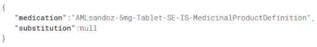
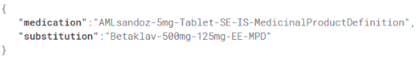

# Pharmawizard4UNICOM

This [Flutter](https://docs.flutter.dev/get-started/install) app, along with the Patient Facing Apps, is critical to the cross-border drug substitution flow. 

The end user of this app is a patient.

The task of this app is to search for a drug that can be included in a medication list in order to generate a QR code to be communicated to the HCP app.
In addition, it is possible to read the QR code generated by the HCP app in able to insert the replacement drug into the medication list.

The QR Codes generated by the apps represent a json consisting of two keys: medication and substitution.

The medication key will correspond to the mpid of the medication selected by the patient, while the substitution key 
will correspond to the mpid of the replacement medication selected by the healthcare provider.

Below are two examples of QR codes with the equivalent json, the first is generated by the user facing app while the 
second is generated by the healthcare provider app.

## QR Code generated by Patient Facing App

## QR Code generated by Healthcare Provider App

